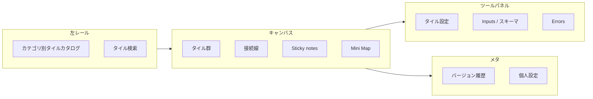

# Domo Magic ETL フロー図機能解析と rakumanual 開発計画

| 項目 | 内容 |
| --- | --- |
| 作成日 | 2026-07-13 |
| 対象 | Domo Magic ETL のキャンバス／フロー図作成 UX |
| 比較対象 | rakumanual `app/src/features/flow/` |
| 目的 | 公式ドキュメントに基づく実装解析と、現行フロー機能のギャップ開発計画 |

---

## 1. 調査範囲と参照ソース

本調査は **Magic ETL の「データ変換タイル」そのものではなく、フロー図キャンバスの作成・編集 UX** に焦点を当てる。rakumanual は業務スイムレーン図であり、ETL ではないため、**キャンバス操作・グラフ編集・検証・ナビ・ドキュメント化** の設計思想を移植対象とする。

### 一次ソース（公式）

| ソース | URL | 抽出した要点 |
| --- | --- | --- |
| Create a Magic ETL DataFlow | https://www.domo.com/docs/s/article/360055259234 | D&D キャンバス、タイル接続、Mini Map、タイル一括選択、Sticky notes、Column Search、未設定タイルの破線接続 |
| Magic ETL Tiles: Disable Tiles | https://www.domo.com/docs/s/article/000005901 | タイル無効化、upstream/downstream 一括選択 |
| Magic ETL enhancements (Add from Canvas 等) | https://www.domo.com/product/new-features/magic-etl-enhancements-w720n | キャンバス上＋追加、検索、よく使うタイル優先、Run to Here、Inputs タブ |
| Magic ETL Enhancements（キャンバス拡張） | https://www.domo.com/product/new-features/magic-etl-enhancements | キャンバス大型化、Mini Map |
| 2026 Release 2 \| March | https://www.domo.com/docs/s/article/March-2026-Release | バージョン閲覧、パネル移動・ピン留め、個人設定永続化、Errors/Inputs パネル方向、Dark Mode |
| Behavior Changes / Feature Updates | https://domo.com/docs/s/article/360047787514 | タイル注釈（annotate）、カテゴリ細分化、プレビュー選択コピー |
| Domo Drop 動画（Mar 2026 Canvas UI） | https://www.youtube.com/watch?v=xdvU0xMyJ7Q | Build in place（右クリック／線上追加）、Errors パネル、パネルカスタマイズ |

> 注: Knowledge Base の一部 HTML はボット対策（CAPTCHA）で直接取得不可だったため、製品発表ページ・Release Notes・サポート記事・動画説明の公開情報で補完した。

---

## 2. Domo Magic ETL「フロー図作成」の実装解析

### 2.1 アーキテクチャ上の骨格

Magic ETL のキャンバスは、次の 4 レイヤで構成される **ノード＝タイル型ビジュアルパイプラインエディタ** である。



| レイヤ | 役割 | rakumanual への写像 |
| --- | --- | --- |
| タイルカタログ | 左パネルから種別を選び投入 | コネクタパネル（`flow-connectors.ts`） |
| キャンバス | 位置・接続・選択・ナビ | `@xyflow/react` + `flow-layout.ts` |
| 設定パネル | 選択タイルの詳細編集 | **ほぼ未実装**（ラベルのインライン編集のみ） |
| 検証・プレビュー | 未設定／エラーの可視化とジャンプ | **未実装** |
| バージョン／注釈 | 履歴・コメント・無効化 | Undo のみ／注釈なし |

### 2.2 キャンバス操作モデル（公式から抽出）

#### A. ノード追加の多経路化（Build in place）

Domo は「左パネルから D&D だけ」に依存しない。

| 追加経路 | 公式での表現 |
| --- | --- |
| 左パネル D&D | 伝統的な投入方法 |
| Add from Canvas（＋ボタン） | 非終端タイル横の＋ → 検索／一覧／よく使う優先 |
| 右クリック Build in place | キャンバス空白・入出力ノード・接続線上からアクション追加 |
| Inputs タブ | 線を引かずに入力元を選択 |

**設計意図:** 大規模キャンバスでは「ドラッグ距離」が認知コストになるため、**挿入点に近い UI から追加**する。

#### B. 接続と状態フィードバック

- タイル側面のノードをドラッグして接続
- **未設定タイル**は次タイルへの接続が破線（未完成の視覚化）
- タイルは原則「上流が設定済みでないと次を設定できない」制約があったが、Power User 更新で **上流なしでも設定可能** に緩和
- Split Join / Split Filter など **複数出力ストリーム** を明示

#### C. 選択・一括操作

- マーキー選択で複数タイルを選択 → まとめて移動／削除
- 右クリック **Select upstream / Select downstream**
- **Disable / Enable actions**（コメントアウト相当）。下流も連動して無効化可能
- 設定パネルのトグルでも個別無効化

#### D. ナビ・探索

- **Mini Map**（ドラッグでビュー移動、大規模フロー向け）
- キャンバスサイズを大幅拡張（4 倍）
- **Column Search**（列名で関連タイルを横断検索）
- 左パネルのタイル検索

#### E. ドキュメント化・共同編集支援

- **Sticky notes / Add Comment**（キャンバス上の注釈）
- タイル単位の **annotate（Notes）**
- **バージョン履歴**: 旧版を現行にせず閲覧、現行化、別 DataFlow として保存

#### F. ワークスペースの個人最適化（2026 UI）

- Errors / Inputs などを **移動・ピン留め可能なツールパネル**
- グリッド線・外観・パネル配置の **個人設定を DataFlow 横断で永続化**
- Dark Mode

#### G. 実行・デバッグ（ETL 固有だが UX パターンとして有用）

- **Run to Here**: 途中までプレビュー実行
- Errors パネル: エラー／未設定を一覧し、クリックで該当位置へジャンプ
- Row telemetry: 各アクションの行数可視化

### 2.3 Domo の UX 原則（抽象化）

業務フロー図へ移植すべき原則は次の 6 点。

1. **挿入点近傍での追加**（＋／右クリック／線上）
2. **未完成状態の可視化**（破線・エラーパネル）
3. **グラフ単位の選択操作**（upstream/downstream、一括無効化）
4. **大規模向けナビ**（Mini Map、検索、キャンバス余裕）
5. **設定はキャンバス外パネル**（選択ノードの詳細編集）
6. **履歴と注釈で共同理解**（バージョン／Sticky notes）

---

## 3. rakumanual 現行フロー機能の実態

実装の中心は `app/src/features/flow/`（`@xyflow/react`）。詳細はコード解析に基づく。

### 3.1 既に強い領域（Domo と同等〜近い）

| 領域 | 現状 |
| --- | --- |
| キャンバス基盤 | React Flow、パン／ズーム、MiniMap、ビューポート制限 |
| コネクタ追加の多経路 | 左パネル／エッジ中＋／ノード右＋／右クリック／D&D |
| レイアウト | 列＝時系列、行＝担当、`autoLayout`、スナップ、差戻し破線 |
| 編集安全装置 | ロック、Undo/Redo（50）、再生成時 `manual` 保護 |
| NL 修正 | 差分プレビュー → 承認／却下（モック解釈） |
| モバイル | 簡易コントロール、担当オーバーレイ |
| 確定連携 | 深掘り項目同期、`recheck` 遷移 |

### 3.2 Domo 対比で明確に弱い／無い領域

| Domo 機能 | rakumanual 現状 | ギャップ種別 |
| --- | --- | --- |
| タイル設定パネル（下部／サイド） | ラベルのダブルクリック編集のみ | **欠落（高）** |
| 未設定／不正接続の破線・Errors パネル | グラフ検証なし | **欠落（高）** |
| マーキー複数選択＋一括移動／削除 UI | 単一選択中心 | **部分欠落（高）** |
| Select upstream / downstream | なし | **欠落（中）** |
| Disable（コメントアウト） | なし | **欠落（中）** |
| Sticky notes / タイル注釈 | なし | **欠落（中）** |
| キャンバス内検索（ステップ／ラベル） | なし（Column Search 相当） | **欠落（中）** |
| コネクタカタログの検索・よく使う優先 | 固定一覧のみ | **部分欠落（低〜中）** |
| Inputs タブ相当（線なし接続） | ハンドル D&D のみ | **欠落（中）** |
| バージョン履歴／スナップショット | Undo のみ・永続化なし | **欠落（高・要件 F-3）** |
| パネル配置の個人設定 | 固定レイアウト | **欠落（低）** |
| 大規模フローのページ分割 | 要件あり・未実装 | **欠落（高・要件 F-2）** |
| レーン追加・改名・並替 UI | 配列依存・UI なし | **欠落（高）** |
| エッジラベル手動編集 | 自動「はい／いいえ」のみ | **欠落（中）** |
| 項番手動編集 | 自動付与のみ（既存保護あり） | **欠落（中）** |
| ノード Copy/Paste | なし | **欠落（中）** |
| 真の並列分岐 | decision 見た目差のみ | **欠落（中）** |
| start 手動追加 | カタログに無し | **部分欠落（低）** |
| サーバー自動保存 | in-memory のみ | **欠落（高・要件）** |

### 3.3 要件定義書（F-2 / F-3）との重複ギャップ

Domo 由来ではなく要件由来だが、開発計画上同じロードマップに載せるべきもの:

- ヒアリング回答に基づく本番 AI 生成（現状モック固定テンプレ）
- 非同期ジョブ生成
- 30 ステップ超の自動ページ分割＋サマリービュー
- サーバー永続化・任意時点スナップショット復元
- NL 修正の LLM 化

---

## 4. ギャップ優先度マトリクス

優先度は **ユーザーが「変更しづらい」と感じる度合い（F-3 最重要）× Domo で実証された有効性 × 実装侵襲度** で判定。

| ID | 機能 | 優先度 | 根拠 |
| --- | --- | --- | --- |
| G1 | グラフ検証＋Errors パネル＋未完成の視覚化 | P0 | Domo Errors／破線。確定前品質に直結 |
| G2 | ステップ詳細パネル（担当・システム・項番・メモ） | P0 | Domo 設定パネル。現状ラベルしか変えられない |
| G3 | レーン管理 UI（追加／改名／並替／削除） | P0 | スイムレーンの前提。現状ほぼ不可 |
| G4 | 複数選択＋一括移動／削除 | P0 | Domo 標準。編集効率の基盤 |
| G5 | サーバー自動保存＋スナップショット | P0 | 要件 F-3。Domo バージョン履歴に相当 |
| G6 | エッジラベル編集・接続ピッカー | P1 | Domo Inputs タブ相当。大規模時の結線苦痛を解消 |
| G7 | upstream/downstream 選択・ソフト無効化 | P1 | Domo Disable / Select *stream |
| G8 | キャンバス検索・コネクタ検索 | P1 | Domo Column Search / タイル検索 |
| G9 | Sticky notes / ステップ注釈 | P1 | Domo Notes。共同理解・レビュー用 |
| G10 | Copy/Paste・キーボードショートカット拡充 | P1 | 編集速度 |
| G11 | 複数ページ／サブプロセス分割 | P1 | 要件 F-2（30+）。Domo 大型キャンバス＋ナビの代替戦略 |
| G12 | 並列分岐の意味的サポート | P2 | Domo Split 系の思想（複数出力の明示） |
| G13 | パネル配置・個人設定 | P2 | Domo 2026 UI。後回し可 |
| G14 | AI 生成／NL の本番化 | P0（別トラック） | 要件核心。キャンバス UX とは並行 |

---

## 5. 開発計画

### 5.0 進め方の方針

- **Domo をコピーしない。** ETL 固有（Run to Here、列スキーマ、SQL 変換）は移植しない。
- **移植するのは「キャンバス編集の設計パターン」**（挿入点近傍、検証可視化、一括選択、設定パネル、履歴、注釈、検索）。
- 既存の `@xyflow/react`＋スイムレーンレイアウトを維持し、破壊的なエンジン置換はしない。
- 各フェーズは **ユーザー操作で完結できること** を受け入れ条件にする（F-3）。

---

### Phase 0 — 基盤整備（データモデル拡張）

**目的:** 後続 UI が乗るスキーマを先に固める。

| 作業 | 詳細 |
| --- | --- |
| `StepData` 拡張 | `notes?: string`, `disabled?: boolean`, `sectionNumber` 手動編集フラグ、`description?` |
| `FlowState` 拡張 | `annotations?: Annotation[]`, `pages?: FlowPage[]`, `validation?` |
| `FlowEdge` メタ | 手動ラベル保持、`invalid?: boolean` |
| 永続化契約 | 要件の `PUT /flow` / スナップショット API 形を型で先定義（モック実装可） |
| レイアウト互換 | `autoLayout` / `enrichEdges` が新フィールドを壊さないこと |

**完了条件:** 既存サンプル（P-001〜P-003）が回帰なく開ける。型変更に伴うコンパイルエラーゼロ。

---

### Phase 1 — P0 編集体験（「変更しづらい」を潰す）

#### 1-A. ステップ詳細パネル（G2）

- ノード選択時に右（または下）にプロパティパネルを表示
- 編集項目: ラベル、kind、担当レーン、利用システム、項番、メモ、manual フラグ表示
- Domo の「キャンバス＋設定パネル」二層構造を踏襲
- モバイルはボトムシート

#### 1-B. レーン管理（G3）

- 担当レーンの追加／改名／並替／削除
- 削除時は所属ノードの退避ルール（確認ダイアログ）
- システム軸（`layoutMeta.columnSystems`）の編集をモバイルでも最低限可能に

#### 1-C. 複数選択（G4）

- React Flow の selectionOnDrag / マーキー選択を有効化（ロック解除時）
- 複数選択時の一括削除、一括レーン移動
- ツールバーに選択数表示

#### 1-D. グラフ検証＋Errors パネル（G1）

検証ルール例:

| ルール | 深刻度 |
| --- | --- |
| start が 0 または 2 以上 | error |
| end 未到達のノード | warning |
| 孤立ノード | error |
| decision の yes/no 欠落 | error |
| 空ラベル | warning |
| disabled 経路で確定不可 | info |

- 左または右に Errors パネル（Domo 同様クリックでフォーカス＋fitView）
- 不正エッジは破線／警告色（Domo の未設定破線に相当）
- **確定ボタンは error がある場合ブロック or 強い確認**

#### 1-E. 自動保存＋スナップショット（G5）

- まずは localStorage / IndexedDB でも可 → 続けて API
- 明示スナップショット名保存、一覧から復元
- Domo「旧版閲覧→現行化／別名保存」を簡易版で再現

**Phase 1 受け入れ:** マウス操作のみでレーン変更・複数削除・プロパティ編集・エラー解消・復元ができる。

---

### Phase 2 — P1 スケール＆共同理解

#### 2-A. 接続 UX（G6）

- エッジラベルのインライン／パネル編集
- 「接続先を選ぶ」ピッカー（Domo Inputs タブ相当）— 遠いノードへのドラッグを不要に
- decision ハンドルの明示ガイド強化

#### 2-B. グラフ操作（G7）

- コンテキストメニュー: 上流選択／下流選択
- ステップのソフト無効化（表示は残し、確定・深掘り対象から除外）
- 無効化時は Domo 同様、下流への影響をプレビュー

#### 2-C. 検索（G8）

- ⌘F 相当: ラベル／項番／レーンでステップ検索 → ハイライト＆ジャンプ
- コネクタパネルに検索＋「よく使う」固定（現状 `よく使う` フラグを UI 反映）

#### 2-D. 注釈（G9）

- キャンバス Sticky note（自由配置、ステップ紐付け任意）
- ステップメモは詳細パネルと同期

#### 2-E. Copy/Paste（G10）

- 選択ノード＋内部エッジの複製
- ペースト時はスナップ位置オフセット、項番は再採番

#### 2-F. 複数ページ（G11）

- 30 ステップ超 or 手動でサブプロセス分割
- ページタブ＋サマリー（縮小図）
- ページ間はリンクロードノードで接続（Domo の巨大キャンバス代替）

**Phase 2 受け入れ:** 50 ステップ規模でも検索・ページ分割・注釈で迷わない。

---

### Phase 3 — P2 高度化と仕上げ

| 項目 | 内容 |
| --- | --- |
| 並列分岐（G12） | fork/join セマンティクス、または decision 複数出力の明示モデル |
| パネル個人設定（G13） | パネル位置・MiniMap 表示・グリッドの永続化 |
| start 追加 | 例外フロー用に start コネクタ解禁（制約付き） |
| フロー画像エクスポート | ExportTab の「フロー図を含める」を実レンダリング接続 |
| アクセシビリティ | キーボードでノード移動・接続・パネル操作 |

---

### Phase 並行トラック — AI / 永続化本番（G14）

キャンバス UX とは独立して並行可能。

| 項目 | 内容 |
| --- | --- |
| `POST /flow/generate` | ヒアリング回答を入力にした非同期生成 |
| `POST /flow/nl-edit` | LLM による構造化差分（現行プレビュー UX を維持） |
| `PUT /flow` + snapshots | Phase 1-E の本番化 |
| 生成根拠 `source` | 回答 ID への実リンク |

---

## 6. 推奨実装順序（スプリント単位の目安）

技術的依存関係のみで並べる（カレンダー見積もりはしない）。

```text
Sprint A: Phase 0（型・永続化契約）
    ↓
Sprint B: 1-A 詳細パネル + 1-B レーン管理
    ↓
Sprint C: 1-C 複数選択 + 1-D 検証/Errors
    ↓
Sprint D: 1-E スナップショット
    ↓
Sprint E: 2-A 接続UX + 2-C 検索
    ↓
Sprint F: 2-B 無効化/上下流 + 2-D 注釈 + 2-E Copy/Paste
    ↓
Sprint G: 2-F 複数ページ
    ↓
Sprint H+: Phase 3 + AI トラック統合
```

並行可能なもの: **AI トラック** は Sprint A 完了後いつでも着手可。

---

## 7. 触るべき主なコードマップ

| 領域 | 主なファイル |
| --- | --- |
| エディタ本体 | `app/src/features/flow/FlowEditorTab.tsx` |
| ノード | `app/src/features/flow/StepNode.tsx` |
| エッジ＋ | `app/src/features/flow/FlowAddEdge.tsx` |
| レイアウト | `app/src/features/flow/flow-layout.ts` |
| コネクタ定義 | `app/src/features/flow/flow-connectors.ts` |
| 項番 | `app/src/features/flow/flow-numbering.ts` |
| 型 | `app/src/lib/types.ts` |
| 要件 | `docs/要件定義書.md`（F-2 / F-3） |

新規追加が想定されるモジュール例:

- `flow-validation.ts` — グラフ検証ルール
- `FlowErrorsPanel.tsx` — Errors UI
- `FlowInspectorPanel.tsx` — ステップ詳細
- `FlowLaneManager.tsx` — レーン CRUD
- `flow-search.ts` / `FlowSearchBar.tsx`
- `FlowAnnotationLayer.tsx`
- `flow-snapshots.ts`

---

## 8. 非目標（Explicitly out of scope）

Domo 固有であり、rakumanual に持ち込まないもの:

- タイルごとのデータプレビュー／行数テレメトリ
- SQL 変換・スキーマ型パネル
- Run to Here 実行エンジン
- Snowflake / BigQuery 実行バックエンド
- ETL タイル種別（Join / Pivot / Deduplicate 等）の移植

---

## 9. 成功指標

| 指標 | 目標 |
| --- | --- |
| F-3 UT | 「フロー図の修正が難しい」= 0（部内 5 名以上） |
| 基本編集完了時間 | レーン変更・ステップ挿入・分岐ラベル修正が案内なしで完了 |
| エラー検出 | 確定前に start/end/孤立/分岐欠落を 100% 検出 |
| 大規模耐性 | 50 ステップで検索 1 操作・ページ分割で全体把握可能 |
| 復元 | 任意スナップショットから 1 分以内に復元 |

---

## 10. 結論

Domo Magic ETL の強みは **タイル種類の多さ** ではなく、**大規模グラフを壊さず速く編集するためのキャンバス OS**（近傍追加・設定パネル・検証パネル・一括選択・履歴・注釈・検索・個人最適化）にある。

rakumanual は既に **近傍追加・MiniMap・Undo・NL 差分・スイムレーン自動整列** という土台を持つ。足りない中核は次の 5 点に収束する。

1. **ステップ／レーンの詳細編集面**
2. **検証と未完成の可視化**
3. **複数選択とグラフ単位操作**
4. **永続スナップショット**
5. **大規模向け検索・ページ分割・注釈**

本計画の Phase 1 を完了すれば、F-3「変更がしづらいのは絶対に NG」に対するキャンバス側の最大リスクを先に潰せる。AI 生成精度は別トラックで並行し、編集 UX の完成度を阻害しない順序とする。
`)