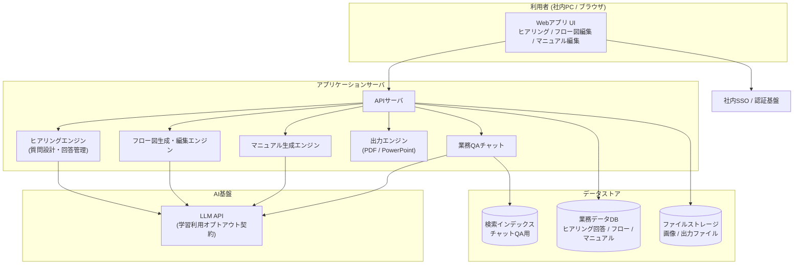
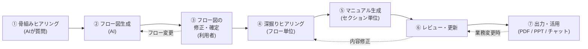

# 業務マニュアル自動作成AIツール「ラクマニュアル」要件定義書

---

## ドキュメント情報

| 項目 | 内容 |
| --- | --- |
| ドキュメント名 | 業務マニュアル自動作成AIツール 要件定義書 |
| プロダクト名(仮) | ラクマニュアル |
| 作成部署 | ○○部 |
| PIC(担当責任者) | (氏名を記載) |
| 承認者 | (上司氏名を記載) |
| ステータス | ドラフト(承認待ち) |

### バージョン履歴

| バージョン | 日付 | 変更内容 | 担当者 |
| --- | --- | --- | --- |
| 0.1.0 | 2026-07-05 | 初版ドラフト作成 | (氏名) |

> バージョン番号は「メジャー.マイナー.パッチ」で運用する。変更時は必ず本履歴に記録し、承認者のレビューを経て更新する。保存場所は部の共有ドライブ(またはリポジトリ)に一元化する。

---

## 1. 概要

### 1-A. プロダクト概要

本プロダクトは、**業務担当者がAIとの対話に答えるだけで、業務フロー図と業務マニュアルを段階的に生成できる社内向けWebアプリケーション**である。

従来、業務マニュアルの作成は「書ける人に依存する」「作成に時間がかかる」「完成後に更新されず陳腐化する」という構造的な課題を抱えている。本プロダクトは、AIによる構造化ヒアリングでこの課題を解決し、**属人化した業務知識を、更新可能な資産として組織に蓄積する**ことを目的とする。

#### システム構成図(概要)

※ 具体的なクラウド基盤・フレームワーク・LLMプロバイダの選定は基本設計フェーズで行う。ただし「社内データを学習に利用しない契約(オプトアウト)が可能なLLMであること」を選定の必須条件とする(5章参照)。

### 1-B. 背景

#### 現状の課題

| 課題 | 影響 |
| --- | --- |
| マニュアル作成が特定の担当者のスキル・時間に依存している | 作成着手までのリードタイムが長く、未整備業務が放置される |
| 業務知識が担当者の頭の中にしかない(属人化) | 異動・退職時の引継ぎコスト増大、業務停止リスク |
| 作成済みマニュアルの更新が困難 | 実態と乖離した「使われないマニュアル」の量産 |
| 文書化スキルの個人差が大きい | マニュアルの品質・粒度がバラバラで検索性が低い |

#### ビジネス目標

- マニュアル1本あたりの作成工数を大幅に削減する(具体目標は 2-D の KPI にて定義)
- 部内業務の文書化率を高め、引継ぎ・教育コストを削減する
- 「作って終わり」ではなく「更新され続ける」マニュアル運用を実現する

#### 背景と要件の対応

| 背景(課題) | 対応する要件 |
| --- | --- |
| 文書化スキルへの依存 | AIヒアリングによる骨組み作成(F-1) |
| 業務全体像の整理が難しい | フロー図の自動生成と対話的修正(F-2, F-3) |
| 作業詳細の抜け漏れ | フロー単位の深掘りヒアリング(F-4) |
| マニュアルの陳腐化 | 更新・メンテナンス機能(F-6) |
| 完成物の活用・配布 | エクスポート・テンプレート・QAチャット(F-7) |

### 1-C. 用語定義

| 用語 | 定義 |
| --- | --- |
| ヒアリングセッション | AIが利用者に質問し回答を収集する一連の対話。フェーズ1(骨組み)とフェーズ2(深掘り)がある |
| 業務フロー図 | 業務のステップ・分岐・担当を図示したもの。本ツールではAIが生成し利用者が編集する |
| セクション | フロー図上のステップ(またはステップ群)に対応するマニュアルの章単位 |
| プロジェクト | 1つの業務マニュアル作成単位。ヒアリング回答・フロー図・マニュアル・画像を包含する |
| LLM | 大規模言語モデル。本ツールのヒアリング・生成・チャット機能の中核となるAI |
| ハルシネーション | AIが事実と異なる内容をもっともらしく生成する現象 |
| デザインテンプレート | 社内ブランドガイドラインに準拠した、マニュアル出力用の体裁定義 |

---

## 2. 業務要件

### 2-A. 業務フロー(本ツールを使ったマニュアル作成の流れ)

本ツールの利用フローは以下の8ステップで構成される。**利用者は各ステップ間を自由に行き来でき、後戻りによるデータ消失は発生させない。**

| ステップ | 主担当 | 内容 |
| --- | --- | --- |
| ① 骨組みヒアリング | 利用者 ⇔ AI | 業務の目的・関係者・開始/終了条件・大まかな手順を質問形式で収集 |
| ② フロー図生成 | AI | ①の回答から業務フロー図を生成(複数ページ対応) |
| ③ フロー図修正 | 利用者 | 誤りの指摘(自然言語)または直接編集で確定 |
| ④ 深掘りヒアリング | 利用者 ⇔ AI | 各フローステップの使用ファイル・具体的作業・注意点を収集 |
| ⑤ マニュアル生成 | AI | セクション単位でマニュアルを生成。画像差し込みポイントを提案 |
| ⑥ レビュー・更新 | 利用者 | 内容の修正、画像添付、承認 |
| ⑦ 出力・活用 | 利用者 | PDF/PowerPoint出力、テンプレート適用、QAチャット利用 |

### 2-B. 規模

| 項目 | 想定値 |
| --- | --- |
| 利用対象 | 当初は自部門(約○○名) → 将来的に全社展開を視野 |
| 同時利用ユーザー数 | 最大○○人(初期)、将来最大○○○人 |
| 作成プロジェクト数 | 初年度 ○○件程度 |
| 1プロジェクトあたりのフローステップ数 | 平均10〜30、最大100ステップ |
| 1セクションあたりのマニュアルページ数 | 平均1〜3ページ、最大10ページ |
| 添付画像 | 1プロジェクトあたり最大○○枚、1枚あたり最大10MB |

> ※ ○○は部内の実数を確認のうえ確定する。規模はLLMコスト試算(4-I)の入力にもなるため、承認前に必ず埋めること。

### 2-C. 時期・時間

| 項目 | 内容 |
| --- | --- |
| 利用時間帯 | 平日業務時間(9:00〜18:00)を中心。夜間バッチ等の定時処理は原則なし |
| ピーク想定 | 期末・異動期(引継ぎ需要)に利用が集中する想定 |
| マスタスケジュール(案) | 要件定義承認 → 基本設計・UX設計(○ヶ月) → 開発(○ヶ月) → 部内パイロット(1〜2ヶ月) → 本稼働 |

> ※ パイロット期間を必ず設ける。UX(特に③フロー図編集)は実利用フィードバックなしに完成度を担保できないため。

### 2-D. 指標(KPI / サービス品質の測定基準) — 仕様⑧

「期待を超える出力・使用感」を主観で終わらせないため、以下のKPIで品質を測定する。**各指標は現状値(Baseline)を稼働前に計測し、ツール内で自動集計できるよう機能要件(F-8)に織り込む。**

#### 効率性(ROIの根拠)

| 指標 | 現状値 | 目標値 | 期限 | 測定方法 |
| --- | --- | --- | --- | --- |
| マニュアル1本あたり作成工数 | 現状計測(想定: 平均○時間) | 50%以上削減 | 稼働3ヶ月後 | プロジェクト開始〜承認完了までの実作業時間を自動記録 |
| 作成完了率(着手→承認まで到達した割合) | — | 80%以上 | 稼働3ヶ月後 | プロジェクトステータスの自動集計 |
| 部内業務の文書化率 | 現状計測 | ○○%以上 | 稼働6ヶ月後 | 対象業務リストに対するマニュアル化済み件数 |

#### 出力品質

| 指標 | 目標値 | 測定方法 |
| --- | --- | --- |
| フロー図の初回生成精度(利用者による大幅作り直しが不要だった割合) | 70%以上 | ③工程での修正操作量 + 生成直後の利用者評価(3段階) |
| マニュアル修正率(AI生成文のうち利用者が書き換えた割合) | 30%以下 | 生成テキストと承認版テキストの差分を自動計測 |
| ハルシネーション起因の重大修正 | 0件(利用者承認プロセスで担保) | レビュー時の修正理由タグ集計 |

#### 使用感(UX)

| 指標 | 目標値 | 測定方法 |
| --- | --- | --- |
| 利用者満足度(CSAT) | 平均4.0以上(5段階) | プロジェクト完了時のツール内アンケート |
| ヒアリング途中離脱率 | 20%以下 | セッション開始〜完了のファネル自動集計 |
| フロー図編集の操作エラー率(取り消し・やり直し頻度) | 継続的に低減 | 操作ログ集計 |

#### 活用度(作って終わりにしない)

| 指標 | 目標値 | 測定方法 |
| --- | --- | --- |
| 完成マニュアルの月間閲覧数・チャット質問数 | 継続的に増加 | アクセスログ・チャットログ集計 |
| 完成後6ヶ月以内に更新されたマニュアルの割合 | 40%以上 | 更新履歴の自動集計 |

### 2-E. 範囲(スコープ)

#### 対象(本プロジェクトで作る)

- 仕様①〜⑧に対応する機能一式(3章参照)
- 社内SSOによる認証・権限管理
- KPI計測用のログ・ダッシュボード基盤

#### 対象外(本プロジェクトでは作らない)

| 対象外項目 | 理由・代替 |
| --- | --- |
| 画面録画・スクリーンショットの自動取得 | 画像は利用者がアップロードする方式とする。自動取得は将来検討 |
| 既存マニュアル(Word/Excel等)の自動取り込み・変換 | 移行要件(6章)で手動移行の位置づけを定義。自動変換は次期フェーズ候補 |
| 多言語対応 | 初期は日本語のみ |
| モバイルアプリ | PCブラウザのみ対象(閲覧はレスポンシブ対応を検討) |
| 社外ユーザーへの公開 | 社内利用限定 |
| 動画マニュアル生成 | 対象外 |

---

## 3. 機能要件

機能は仕様①〜⑧に対応する8つの大分類(F-1〜F-8)+基盤機能(F-0)で構成する。

### 機能一覧(ブレイクダウン)

| ID | 大分類 | 中分類 | 概要 | 対応仕様 |
| --- | --- | --- | --- | --- |
| F-0 | 基盤 | 認証・プロジェクト管理 | SSOログイン、プロジェクトの作成・一覧・権限管理 | — |
| F-1 | 骨組みヒアリング | 構造化質問エンジン | AIが対話形式で業務の骨組み情報を収集 | ① |
| F-2 | フロー図生成 | AI生成・複数ページ | ヒアリング結果から業務フロー図を自動生成 | ② |
| F-3 | フロー図編集 | 直接編集・自然言語修正 | 利用者によるフロー図の修正・確定 | ③ |
| F-4 | 深掘りヒアリング | フロー単位の詳細収集 | 各ステップの使用ファイル・作業詳細を収集 | ④ |
| F-5 | マニュアル生成 | セクション単位生成・画像 | マニュアル本文の生成と画像差し込み | ⑤ |
| F-6 | 更新・メンテナンス | 編集・履歴・部分再生成 | 完成後の修正と履歴管理 | ⑥ |
| F-7 | 出力・活用 | PDF/PPT・テンプレート・チャット | エクスポートと業務QAチャット | ⑦ |
| F-8 | 品質測定 | ログ・ダッシュボード | KPI自動集計と可視化 | ⑧ |

---

### F-1. 骨組みヒアリング機能(仕様①)

**業務のコンテキストを漏れなく収集する本プロダクトの心臓部。質問数が多くなることは許容し、その代わり利用者が疲弊しない対話設計を最優先する。**

#### 機能詳細

| 機能 | 内容 |
| --- | --- |
| 質問フレームワーク | 業務名 → 目的 → 関係者(誰から受け取り誰へ渡すか) → 開始条件/完了条件 → 頻度・タイミング → 大まかな手順 → 例外・分岐、の順に体系立てて質問する。5W1Hの観点を網羅する質問テンプレートをベースに、回答内容に応じてAIが追加質問を動的生成する |
| 回答形式の多様化 | 自由記述だけでなく、選択肢・複数選択・スキップを質問ごとに使い分け、入力負荷を下げる |
| 進捗の可視化 | 「全体のどのあたりか」を常時表示(プログレスバー+残り質問の目安)。終わりが見えない対話にしない |
| 中断・再開 | 回答は1問ごとに自動保存。ブラウザを閉じても続きから再開できる |
| 回答の見直し | 過去の回答一覧を常時参照でき、任意の回答を後から修正できる。修正時は影響範囲(再生成が必要な箇所)を提示する |
| わからない・後で答える | 「わからない」「後で」を正当な回答として許容し、未回答リストとして管理する |

#### 受け入れ条件(抜粋)

- 回答が1問ごとに保存され、セッション中断後に完全に復元されること
- 利用者が過去の回答を修正した場合、矛盾する後続回答をAIが検出し確認を促すこと
- ヒアリング完了までの離脱率をログで計測できること(F-8連携)

---

### F-2. フロー図生成機能(仕様②)

#### 機能詳細

| 機能 | 内容 |
| --- | --- |
| 自動生成 | F-1の回答をもとに、担当者レーン(スイムレーン)・処理・条件分岐・開始/終了を含む業務フロー図を生成する |
| 複数ページ対応 | ステップ数が多い業務は、意味のまとまり(サブプロセス)単位で自動的にページ分割する。ページ間の接続(「Aへ続く」)を明示し、全体を俯瞰できるサマリービューも提供する |
| 生成根拠の提示 | 各ステップがどのヒアリング回答に基づくかをトレースできる(誤り発見を容易にするため) |
| 再生成 | 回答修正後、フロー図全体または一部のみを再生成できる。**利用者が手動修正した箇所は再生成時に上書きしない(保護する)** |

#### 受け入れ条件(抜粋)

- ヒアリング回答に含まれる手順・分岐・担当者が漏れなくフロー図に反映されること
- 30ステップを超える業務で自動ページ分割が機能し、ページ間の遷移が追えること
- 手動修正済みステップが再生成で消失しないこと(最重要)

---

### F-3. フロー図編集機能(仕様③)

**「変更がしづらいのは絶対にNG」という要件を満たすため、UXを最優先に設計する。本機能はパイロットでのユーザビリティテストを合格条件とする。**

#### 機能詳細

| 機能 | 内容 |
| --- | --- |
| 直接編集 | ドラッグ&ドロップによるステップの移動・追加・削除・結線変更。テキストはダブルクリックでその場編集 |
| 自然言語での修正指示 | 「ステップ3と4の間に承認作業が入る」のようにチャットで指摘すると、AIが修正案を差分プレビューで提示し、利用者が承認して反映する(勝手に書き換えない) |
| 取り消し・やり直し | 全編集操作に対して無制限のUndo/Redoを提供する |
| 自動整列 | 手動編集後もレイアウトが崩れないよう、自動整列・自動結線を提供する |
| 版の保存 | 編集途中の状態も自動保存。任意時点のスナップショットに戻せる |

#### 受け入れ条件(抜粋)

- ステップの追加・削除・並び替え・分岐変更のすべてがマウス操作のみで完結すること
- 自然言語指示による修正が、適用前に必ず差分プレビューとして提示されること
- いかなる編集操作もUndoで復元できること
- ユーザビリティテスト(部内5名以上)で「フロー図の修正が難しい」という評価が0件であること

---

### F-4. 深掘りヒアリング機能(仕様④)

#### 機能詳細

| 機能 | 内容 |
| --- | --- |
| フロー単位のヒアリング | 確定したフロー図の各ステップ(またはセクション)を対象に、順番に深掘り質問を行う。対象ステップがフロー図上でハイライトされ、いま何について答えているかが常に明確 |
| 収集項目 | 使用するファイル・システム・画面 / 具体的な操作手順 / 判断基準 / 所要時間 / よくあるミス・注意点 / 例外時の対応 / 関連資料 |
| ファイル情報の登録 | 使用ファイルは名称・保管場所・用途を構造化して登録。ファイル自体の添付も可能 |
| 順不同・部分完了 | ステップの好きな順に回答でき、一部だけ完了した状態でもマニュアル生成(F-5)に進める(未回答セクションはプレースホルダ表示) |
| ヒアリング密度の調整 | ステップの重要度(利用者が指定)に応じて質問の深さを変え、全ステップ均一に長い質問攻めになることを避ける |

#### 受け入れ条件(抜粋)

- 各ステップのヒアリング状況(未着手/回答中/完了)が一覧で把握できること
- フロー図をF-3で修正した場合、影響を受けるヒアリング項目が自動で「要確認」になること

---

### F-5. マニュアル生成機能(仕様⑤)

#### 機能詳細

| 機能 | 内容 |
| --- | --- |
| セクション単位の生成 | フロー図のセクションごとにマニュアルを生成する。全体一括ではなくセクション単位で生成・確認・確定を回せる |
| 冗長性の抑制 | 文書全体の構成ルール(1手順=1文、重複説明の排除、共通事項の「共通편」への集約)を生成プロンプトに組み込む。生成後に冗長度チェックを行い、既定ページ数(セクションあたり目安○ページ)を超える場合は分割または要約を提案する |
| 複数ページ対応 | 1セクションが複数ページになる場合は見出し階層・ページ内目次を自動生成する |
| 画像差し込み(ヘルプボタン方式) | 手順の任意の位置に画像を添付できる。**本文中では「画像を見る」ボタン(ヘルプアイコン)として表示され、クリックで展開/折りたたみできる。** これにより文字と画像の混在によるインデント崩れを防ぎ、テキストの流れを保ったまま必要な人だけが画像を参照できる |
| 画像管理 | 画像はキャプション・対応手順との紐付けを持つ。差し替え時は該当箇所のみ更新される |
| 生成と実データの分離 | AIが推測で補完した箇所は「要確認」マークを付けて明示し、利用者の確認なしに確定させない(ハルシネーション対策) |

#### 受け入れ条件(抜粋)

- 画像の表示/非表示切り替えが本文レイアウト(インデント・改ページ)に影響を与えないこと
- 「要確認」マークが全て解消されるまでセクションを「承認済み」にできないこと
- 同一内容の説明がセクション間で重複した場合に検出・集約提案されること

---

### F-6. 更新・メンテナンス機能(仕様⑥)

#### 機能詳細

| 機能 | 内容 |
| --- | --- |
| 直接編集 | 承認済みマニュアルも、リッチテキストエディタでいつでも修正可能 |
| AIによる部分再生成 | 「このステップのやり方が変わった」と伝えると、該当セクションのみ再ヒアリング→再生成する。他セクションには影響しない |
| 更新履歴 | 全ての変更を「いつ・誰が・何を」の粒度で記録。任意の過去版と差分比較・復元が可能 |
| 版管理 | 「公開版」と「編集中ドラフト」を分離し、編集途中の内容が閲覧者に見えないようにする |
| 陳腐化防止 | マニュアルごとに「見直し期限」を設定でき、期限が近づくと作成者に通知する |
| 引継ぎ対応 | マニュアルのオーナー(メンテナンス責任者)を変更できる |

#### 受け入れ条件(抜粋)

- セクション単位の再生成が他セクションの内容・画像を変更しないこと
- 過去版との差分が視覚的に確認でき、ワンクリックで復元できること

---

### F-7. 出力・活用機能(仕様⑦)

#### F-7-1. エクスポート

| 機能 | 内容 |
| --- | --- |
| PDF出力 | マニュアル(フロー図含む)をPDF出力。画像は「全画像を展開して出力」「画像は巻末にまとめる」「画像なし」から選択可能 |
| PowerPoint出力 | セクション構成をスライド構成にマッピングして出力。編集可能なpptx形式 |
| 出力範囲指定 | マニュアル全体/特定セクションのみ、を選択可能 |

#### F-7-2. デザインテンプレート

| 機能 | 内容 |
| --- | --- |
| 社内テンプレート選択 | 社内ブランドガイドライン準拠のテンプレート(表紙・ヘッダフッタ・配色・フォント)を複数登録し、出力時に選択できる |
| テンプレート管理 | 管理者がテンプレートを追加・更新できる。既存マニュアルへの一括適用も可能 |

#### F-7-3. 業務QAチャット

| 機能 | 内容 |
| --- | --- |
| マニュアル横断QA | 完成したマニュアル群を知識ベースとして、「○○の申請ってどうやるの?」といった質問にチャットで回答する |
| 出典の明示 | 回答には必ず根拠となるマニュアル・セクションへのリンクを付ける。**根拠が見つからない場合は「該当するマニュアルがありません」と回答し、推測で答えない** |
| 権限の尊重 | 質問者が閲覧権限を持つマニュアルのみを回答根拠に使う |
| フィードバック | 回答への「役に立った/立たなかった」評価を収集し、F-8で集計。未回答の質問はマニュアル整備の需要シグナルとして作成者に通知する |

#### 受け入れ条件(抜粋)

- PDF/PPT出力でテンプレートの体裁(フォント・配色・ロゴ)が正しく適用されること
- チャット回答に出典リンクが100%付与されること(根拠なし回答の場合はその旨の明示)
- 閲覧権限のないマニュアルの内容がチャット経由で漏れないこと(セキュリティテスト対象)

---

### F-8. 品質測定機能(仕様⑧)

2-DのKPIを「測れる設計」にするための機能。

| 機能 | 内容 |
| --- | --- |
| 操作ログ収集 | ヒアリング進捗、編集操作、生成のやり直し、出力、チャット利用を自動記録 |
| 満足度収集 | プロジェクト完了時・チャット回答時にツール内で簡易アンケート(CSAT)を収集 |
| KPIダッシュボード | 2-Dの各指標を管理者向けに自動集計・可視化する |
| LLMコスト監視 | プロジェクトあたり・月あたりのトークン消費と概算コストを可視化し、閾値超過時に管理者へ通知する |

---

### 画面一覧(主要画面)

| 画面ID | 画面名 | 目的・役割 | 対応機能 |
| --- | --- | --- | --- |
| SCR-001 | ログイン(SSO) | 社内認証基盤経由のログイン | F-0 |
| SCR-002 | プロジェクト一覧 | 作成中/完成マニュアルの一覧・検索・新規作成 | F-0 |
| SCR-003 | ヒアリング画面 | AIとの対話UI。進捗表示・回答履歴・中断再開 | F-1, F-4 |
| SCR-004 | フロー図エディタ | フロー図の閲覧・直接編集・自然言語修正・ページ切替 | F-2, F-3 |
| SCR-005 | マニュアルエディタ | セクション単位の生成結果確認・編集・画像管理 | F-5, F-6 |
| SCR-006 | マニュアル閲覧画面 | 閲覧者向け表示。画像の展開/折りたたみ、検索 | F-5, F-7 |
| SCR-007 | エクスポート設定 | 出力形式・テンプレート・範囲の選択 | F-7 |
| SCR-008 | QAチャット | 業務質問チャット | F-7 |
| SCR-009 | 管理ダッシュボード | KPI・コスト・利用状況の可視化 | F-8 |
| SCR-010 | 管理設定 | テンプレート管理、ユーザー権限、見直し期限設定 | F-0, F-7 |

### 情報・データ(主要データモデル概要)

| データ | 主な属性 | 備考 |
| --- | --- | --- |
| プロジェクト | 名称、オーナー、ステータス、権限設定 | マニュアル1本の単位 |
| ヒアリング回答 | 質問ID、回答内容、回答日時、確定/要確認フラグ | 1問ごとに保存 |
| フロー図 | ステップ、結線、レーン、ページ、手動修正フラグ | 手動修正保護のためのフラグを持つ |
| マニュアルセクション | 本文(構造化)、版、承認状態、要確認マーク | 公開版とドラフトを分離 |
| 画像 | ファイル、キャプション、紐付け手順、表示位置 | ストレージに保存、DBは参照を保持 |
| 変更履歴 | 対象、変更前後、実施者、日時 | F-6の版管理・監査に使用 |
| 操作ログ | ユーザー、操作種別、タイムスタンプ | KPI集計用。保持期間は5章で定義 |

### 外部インターフェース

| IF名 | 接続先 | 目的 | 備考 |
| --- | --- | --- | --- |
| LLM API | 選定LLMプロバイダ | ヒアリング・生成・チャット | HTTPS、学習オプトアウト契約必須 |
| SSO連携 | 社内認証基盤 | 認証・ユーザー情報取得 | SAML/OIDC(社内標準に準拠) |
| (将来)社内ポータル連携 | 社内ポータル | マニュアルへのリンク共有 | 次期フェーズ検討 |

---

## 4. 非機能要件

### 4-A. ユーザビリティ・アクセシビリティ

**本プロダクトは「使用感が期待を超える」ことが承認条件であるため、ユーザビリティを非機能要件の最上位に置く。**

- 対象ユーザー: ITリテラシーが高くない業務担当者を含む全部員。トレーニングなしで初回利用が完了できることを目標とする
- 主要導線の目標: プロジェクト作成からヒアリング開始まで3クリック以内
- フロー図編集: 前述F-3の受け入れ条件(ユーザビリティテスト合格)を必須とする
- AI処理中の体感速度: 生成待ちの間は進捗表示+ストリーミング表示(生成途中から見せる)で体感待ち時間を短縮する
- 誤操作防止: 破壊的操作(削除・上書き再生成)には必ず確認と復元手段を用意する
- アクセシビリティ: キーボード操作対応、コントラスト比の確保(WCAG 2.1 AA相当を目安)
- ユーザビリティテスト: パイロット期間中に部内5名以上で実施し、タスク完遂率と主観評価を記録する

### 4-B. システム方式

- 社内利用のWebアプリケーション(PCブラウザ対象)
- クラウド/オンプレの選定は情報システム部門のポリシーに従い基本設計で確定する
- LLMは外部API利用を基本とし、プロバイダ変更に耐えられるよう抽象化レイヤを設ける

### 4-C. 規模(スケーラビリティ)

- 2-Bの規模想定に基づき初期構成を設計する
- 全社展開(ユーザー数10倍)時にアーキテクチャの作り直しが不要な構成とする

### 4-D. 性能

| 項目 | 目標 |
| --- | --- |
| 通常画面の表示 | 3秒以内 |
| フロー図編集操作の反映 | 0.5秒以内(ローカル操作は即時) |
| AI生成(フロー図・マニュアル1セクション) | 初回表示(ストリーミング開始)まで10秒以内、完了まで60秒以内を目安 |
| チャット回答 | 初回表示まで5秒以内を目安 |
| PDF/PPT出力 | 50ページ規模で2分以内 |

### 4-E. 信頼性

- 稼働率: 業務時間内 99.5%以上を目標(社内システム基準に準拠)
- データ保全: 1問ごとの自動保存により、障害時もヒアリング回答・編集内容が失われないこと
- バックアップ: 日次フルバックアップ。RPO 24時間以内、RTO 1営業日以内を目安

### 4-F. 拡張性

- 質問テンプレート・デザインテンプレートは管理画面から追加可能な設計とする(コード改修不要)
- 将来の追加候補(既存マニュアル取り込み、画面キャプチャ連携、多言語)を見据えたモジュール構成とする

### 4-G. 互換性

- 過去に作成したプロジェクトデータは、ツールのバージョンアップ後も読み込み・編集できること
- 出力ファイルは Microsoft Office(社内標準バージョン)で正しく開けること

### 4-H. 継続性

- 社内システム標準のバックアップ・障害対応ポリシーに準拠する
- LLM API障害時もマニュアルの閲覧・手動編集・出力は継続できる(AI機能のみ縮退)

### 4-I. AI・LLM固有の考慮点

| 項目 | 方針 |
| --- | --- |
| 応答時間 | 4-Dの通り。ストリーミング表示を必須とする |
| コスト | 想定利用回数×平均トークン数から月間コスト上限を設定(承認時に試算を添付)。上限の80%到達で管理者に通知、100%到達時は新規生成を一時制限(閲覧・編集は継続) |
| 出力の非決定性 | 生成結果は毎回異なりうる前提で、利用者の確認・承認を挟むフローとする(F-5)。再生成時も手動修正箇所は保護する(F-2) |
| ハルシネーション対策 | AIの推測箇所に「要確認」マークを必須表示(F-5)。チャットは出典必須・根拠なし回答禁止(F-7-3)。**最終的な内容の正しさは利用者(業務担当者)の承認によって担保する** |
| フォールバック | LLM障害・レート制限時はその旨を明示し、入力済みデータを保全したうえでリトライ可能にする |
| プロバイダ依存の低減 | LLM抽象化レイヤにより、プロバイダ変更・モデル更新時の影響を局所化する |

---

## 5. セキュリティ要件

### 5-A. 情報セキュリティ

| 項目 | 方針 |
| --- | --- |
| 情報分類 | 業務マニュアルおよびヒアリング回答は「社外秘」として扱う |
| 認証 | 社内SSO必須。社外ネットワークからのアクセスは社内VPNポリシーに準拠 |
| アクセス制御 | ロールベース(閲覧者/作成者/管理者)+プロジェクト単位の権限設定。部外秘マニュアルは指定メンバーのみ閲覧可 |
| 通信・保管の暗号化 | 通信はTLS、保管データは暗号化(AES-256相当) |
| 監査ログ | 閲覧・編集・出力・チャット質問の操作ログを記録。保持期間は社内規程に準拠(目安1年以上) |

### 5-B. 稼働環境

- 対応ブラウザ: 社内標準ブラウザ(Chrome / Edge)の最新版
- 対応OS: 社内標準PC環境(Windows / macOS のサポート中バージョン)

### 5-C. テスト

- 機能テストに加え、脆弱性診断(XSS・SQLインジェクション・認可バイパス)を本稼働前に実施する
- **チャット経由の権限外情報漏洩(F-7-3)を必須テスト項目とする**
- テストデータは実業務データを使わず、ダミーデータで実施する

### 5-D. AI・LLM利用時のセキュリティ

| 項目 | 方針 |
| --- | --- |
| 機密情報の外部送信 | LLMプロバイダとの契約で「入力データを学習に利用しない(オプトアウト)」を必須条件とする。データ保存場所・保持期間を確認し、情報システム部門・法務の承認を得る |
| 個人情報の取り扱い | ヒアリングで個人情報を入力しないよう利用ガイドで明示し、入力時の注意喚起をUIに組み込む |
| プロンプトインジェクション対策 | システム指示とユーザー入力を分離する。チャットの回答根拠(マニュアル本文)に埋め込まれた指示文が動作を変えないよう検証する |
| 出力のアクセス制御 | AIに渡すコンテキストを質問者の閲覧権限内に制限する(F-7-3) |
| 入出力ログ | 誰がどんな入力をし、AIが何を出力したかを記録し、問題発生時に追跡可能とする |
| 生成物の権利 | 利用するLLMサービスの利用規約における生成物の商用利用可否・権利帰属を契約前に確認する |

---

## 6. 移行要件

本プロダクトは新規構築のためシステム移行は発生しないが、以下を定義する。

### 6-A. 既存マニュアル資産の扱い

- 既存のWord/Excel/PowerPointマニュアルの自動取り込みはスコープ外(2-E)
- 優先度の高い業務から本ツールで「作り直す」方針とする。既存資産はヒアリング回答時の参照資料として活用する
- 移行対象業務のリストと優先順位はパイロット開始前に部内で確定する

### 6-B. 引継ぎ

- 開発ベンダー(または開発チーム)から運用担当への引継ぎとして、運用手順書・障害対応手順・LLMコスト管理手順のドキュメント提供とハンズオンを必須とする
- 引継ぎ後1ヶ月間は開発側の並走サポート期間を設ける

---

## 7. 運用要件

### 7-A. 教育

| 項目 | 内容 |
| --- | --- |
| 目的 | 全部員がトレーニングなしで基本利用できることが理想だが、初回展開時は活用促進のため説明会を実施する |
| 対象・内容 | 一般利用者: 30分程度の操作説明会+ツール内チュートリアル / 管理者: テンプレート管理・KPIダッシュボード・コスト管理の研修 |
| 教材 | 本ツール自身で本ツールの操作マニュアルを作成する(ドッグフーディング。品質検証を兼ねる) |

### 7-B. 運用

| 項目 | 内容 |
| --- | --- |
| 運用体制 | PIC(業務側管理者)+情報システム部門(基盤)+開発保守窓口の3者体制 |
| 定常運用 | KPIダッシュボードの月次確認、LLMコストの月次確認、見直し期限切れマニュアルの棚卸し |
| 問い合わせ | 部内ヘルプ窓口(チャットまたはメール)を設置。FAQはツール内に蓄積 |
| 改善サイクル | KPI(2-D)を月次でレビューし、質問テンプレート・生成プロンプトの改善を四半期ごとに実施 |

### 7-C. 保守

| 項目 | 内容 |
| --- | --- |
| ソフトウェア保守 | セキュリティパッチ適用、不具合修正、LLMモデル更新への追従 |
| 監視 | 死活監視、エラー率監視、LLM APIの応答監視・コスト監視 |
| 障害対応 | 障害レベル定義と対応時間(例: 全断は当日対応)を保守契約で定める |
| データ保守 | 日次バックアップの取得確認、四半期ごとのリストア訓練 |

---

## 8. 承認にあたっての確認事項(要決定事項)

以下は承認プロセスの中で確定が必要な項目である。

| # | 項目 | 決定者 | 期限 |
| --- | --- | --- | --- |
| 1 | 利用規模の実数(2-Bの○○部分) | PIC | 承認前 |
| 2 | 現状のマニュアル作成工数の計測(KPIのBaseline) | PIC・部内 | 承認前 |
| 3 | LLMプロバイダ候補と月間コスト試算 | PIC・情シス | 承認前 |
| 4 | 社内SSO・ネットワークポリシーとの適合確認 | 情シス | 基本設計前 |
| 5 | 開発体制(内製/ベンダー)と概算予算・スケジュール | 上長・PIC | 承認時 |
| 6 | 社内デザインテンプレートの提供元(ブランドガイドライン) | 総務・広報 | 開発中 |

---

以上
