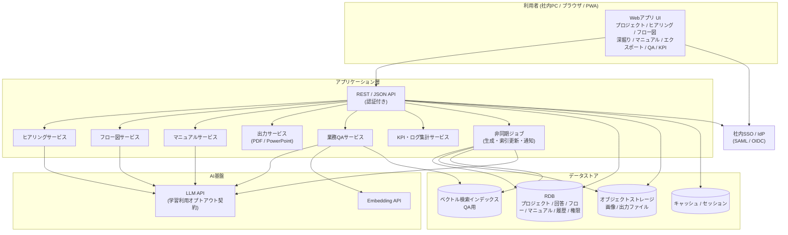
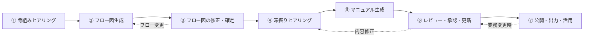

# 業務マニュアル自動作成AIツール「ラクマニュアル」要件定義書

---

## ドキュメント情報

| 項目 | 内容 |
| --- | --- |
| ドキュメント名 | 業務マニュアル自動作成AIツール 要件定義書 |
| プロダクト名 | ラクマニュアル (RakuManual) |
| 作成部署 | ○○部 |
| PIC(担当責任者) | (氏名を記載) |
| 承認者 | (上司氏名を記載) |
| ステータス | ドラフト(承認待ち) |

### バージョン履歴

| バージョン | 日付 | 変更内容 | 担当者 |
| --- | --- | --- | --- |
| 0.1.0 | 2026-07-05 | 初版ドラフト作成 | (氏名) |
| 0.2.0 | 2026-07-12 | 現行アプリの機能・画面・データモデルに合わせて全面改訂。API/バックエンド実装を前提とした要件として再構成 | (氏名) |

> バージョン番号は「メジャー.マイナー.パッチ」で運用する。変更時は必ず本履歴に記録し、承認者のレビューを経て更新する。保存場所は部の共有ドライブ(またはリポジトリ)に一元化する。

---

## 1. 概要

### 1-A. プロダクト概要

本プロダクトは、**業務担当者がAIとの対話に答えるだけで、業務フロー図と業務マニュアルを段階的に生成できる社内向けWebアプリケーション**である。

利用者はブラウザ上で次の一連の流れを完結できる。

1. 骨組みヒアリング(チャット形式)で業務の骨格を回答する
2. AIがスイムレーン型の業務フロー図を生成する
3. 直接編集または自然言語指示でフロー図を修正・確定する
4. ステップ単位の深掘りヒアリングで詳細を収集する
5. 階層項番付きマニュアルをセクション単位で生成・承認する
6. PDF / PowerPoint 出力、および業務QAチャットで活用する

従来、業務マニュアルの作成は「書ける人に依存する」「作成に時間がかかる」「完成後に更新されず陳腐化する」という構造的な課題を抱えている。本プロダクトは、AIによる構造化ヒアリングでこの課題を解決し、**属人化した業務知識を、更新可能な資産として組織に蓄積する**ことを目的とする。

#### システム構成図(概要)

#### 技術構成(想定)

| 層 | 想定技術 | 備考 |
| --- | --- | --- |
| フロントエンド | SPA(React + TypeScript)、Tailwind CSS、フロー図はノードエディタ(@xyflow 相当) | PWA対応。PCブラウザ主、モバイルは閲覧・簡易操作 |
| API | REST / JSON。認証はSSOトークン(JWT等) | 生成系は非同期ジョブ化し、進捗をポーリングまたはストリーミングで返す |
| 永続化 | RDB(プロジェクト・権限・履歴) + オブジェクトストレージ(画像・出力物) | ヒアリング回答は1問ごとに永続化 |
| AI | LLM抽象化レイヤ経由で外部LLMを呼ぶ | プロバイダ変更に耐えること。学習オプトアウト必須 |
| 検索 | 公開済みマニュアルのベクトル索引 | QAチャットの出典検索に使用 |

※ クラウド基盤・具体的なフレームワーク・LLMプロバイダの最終選定は基本設計フェーズで行う。ただし「社内データを学習に利用しない契約(オプトアウト)が可能なLLMであること」を選定の必須条件とする(5章参照)。

### 1-B. 背景

#### 現状の課題

| 課題 | 影響 |
| --- | --- |
| マニュアル作成が特定の担当者のスキル・時間に依存している | 作成着手までのリードタイムが長く、未整備業務が放置される |
| 業務知識が担当者の頭の中にしかない(属人化) | 異動・退職時の引継ぎコスト増大、業務停止リスク |
| 作成済みマニュアルの更新が困難 | 実態と乖離した「使われないマニュアル」の量産 |
| 文書化スキルの個人差が大きい | マニュアルの品質・粒度がバラバラで検索性が低い |

#### ビジネス目標

- マニュアル1本あたりの作成工数を大幅に削減する(具体目標は 2-D の KPI にて定義)
- 部内業務の文書化率を高め、引継ぎ・教育コストを削減する
- 「作って終わり」ではなく「更新され続ける」マニュアル運用を実現する
- 完成マニュアルをQAチャットで日常業務から参照できるようにする

#### 背景と要件の対応

| 背景(課題) | 対応する要件 |
| --- | --- |
| 文書化スキルへの依存 | AIヒアリングによる骨組み作成(F-1) |
| 業務全体像の整理が難しい | フロー図の自動生成と対話的修正(F-2, F-3) |
| 作業詳細の抜け漏れ | フロー単位の深掘りヒアリング(F-4) |
| マニュアルの陳腐化 | 更新・メンテナンス機能(F-6) |
| 完成物の活用・配布 | エクスポート・テンプレート・QAチャット(F-7) |
| 効果測定・改善 | KPIダッシュボード(F-8) |

### 1-C. 用語定義

| 用語 | 定義 |
| --- | --- |
| プロジェクト | 1つの業務マニュアル作成単位。ヒアリング回答・フロー図・深掘り・マニュアル・画像・履歴を包含する |
| ヒアリングセッション | AIが利用者に質問し回答を収集する一連の対話。骨組み(F-1)と深掘り(F-4)がある |
| 業務フロー図 | 担当レーン(縦)×利用システム(横)のスイムレーン上に、開始/処理/分岐/終了ステップを配置した図 |
| 項番 | マニュアル・フロー上の番号。中項目は `1.1` / `2.1` 形式。大項目跨ぎを許容する |
| 大項目 / 中項目 | マニュアルの階層。大項目=業務領域、中項目=業務概要(例: 新規申請)。セクション本文はその下に属する |
| セクション | フロー図上のステップ(またはステップ群)に対応するマニュアルの章単位 |
| 要確認マーク | AIが推測で補完した箇所を示すフラグ。解消までセクション承認不可 |
| 公開版 | 閲覧者・QAチャットの根拠として利用される、承認済みセクションを含む公開状態のマニュアル |
| LLM | 大規模言語モデル。ヒアリング・生成・チャットの中核AI |
| ハルシネーション | AIが事実と異なる内容をもっともらしく生成する現象 |
| デザインテンプレート | 社内ブランドガイドラインに準拠した、マニュアル出力用の体裁定義 |

---

## 2. 業務要件

### 2-A. 業務フロー(本ツールを使ったマニュアル作成の流れ)

本ツールの利用フローは以下の工程で構成される。**利用者は各工程のタブ間を自由に行き来でき、後戻りによるデータ消失は発生させない。** 各操作はAPI経由でサーバーに永続化される。

| ステップ | 主担当 | 内容 | プロジェクト状態 |
| --- | --- | --- | --- |
| ① 骨組みヒアリング | 利用者 ⇔ AI | 業務の目的・関係者・開始/終了条件・大まかな手順を質問形式で収集。1問ごとに自動保存 | `hearing` |
| ② フロー図生成 | AI | ①の回答からスイムレーン型フロー図を生成。項番・生成根拠を付与 | `flow` |
| ③ フロー図修正 | 利用者 | 直接編集または自然言語指示で修正し、確定すると深掘り対象ステップが生成される | `flow` → `deepdive` |
| ④ 深掘りヒアリング | 利用者 ⇔ AI | 各ステップの操作・判断基準・注意点を重要度に応じて収集。順不同・部分完了可 | `deepdive` |
| ⑤ マニュアル生成 | AI | セクション単位で本文を生成。大項目→中項目の階層と要確認マークを付与 | `manual` |
| ⑥ レビュー・承認 | 利用者 | 画像添付・本文修正・要確認解消・セクション承認。見直し期限を設定可能 | `manual` |
| ⑦ 公開・出力・活用 | 利用者 | プロジェクト公開、PDF/PPTX出力、QAチャットでの参照 | `published` |

### 2-B. 規模

| 項目 | 想定値 |
| --- | --- |
| 利用対象 | 当初は自部門(約○○名) → 将来的に全社展開を視野 |
| 同時利用ユーザー数 | 最大○○人(初期)、将来最大○○○人 |
| 作成プロジェクト数 | 初年度 ○○件程度 |
| 1プロジェクトあたりのフローステップ数 | 平均10〜30、最大100ステップ |
| 1セクションあたりのマニュアルページ数 | 平均1〜3ページ、最大10ページ |
| 添付画像 | 1プロジェクトあたり最大○○枚、1枚あたり最大10MB(アップロード時はクライアント側でもサイズ検証) |

> ※ ○○は部内の実数を確認のうえ確定する。規模はLLMコスト試算(4-I)の入力にもなるため、承認前に必ず埋めること。

### 2-C. 時期・時間

| 項目 | 内容 |
| --- | --- |
| 利用時間帯 | 平日業務時間(9:00〜18:00)を中心。夜間バッチ等の定時処理は原則なし(索引更新・通知は非同期ジョブ可) |
| ピーク想定 | 期末・異動期(引継ぎ需要)に利用が集中する想定 |
| マスタスケジュール(案) | 要件定義承認 → 基本設計・UX設計(○ヶ月) → 開発(○ヶ月) → 部内パイロット(1〜2ヶ月) → 本稼働 |

> ※ パイロット期間を必ず設ける。UX(特に③フロー図編集)は実利用フィードバックなしに完成度を担保できないため。

### 2-D. 指標(KPI / サービス品質の測定基準) — 仕様⑧

「期待を超える出力・使用感」を主観で終わらせないため、以下のKPIで品質を測定する。**各指標は現状値(Baseline)を稼働前に計測し、操作ログ・プロジェクト状態からツール内で自動集計する(F-8)。**

#### 効率性(ROIの根拠)

| 指標 | 現状値 | 目標値 | 期限 | 測定方法 |
| --- | --- | --- | --- | --- |
| マニュアル1本あたり作成工数 | 現状計測(想定: 平均○時間) | 50%以上削減 | 稼働3ヶ月後 | プロジェクト開始〜公開完了までの実作業時間を自動記録 |
| 作成完了率(着手→公開まで到達した割合) | — | 80%以上 | 稼働3ヶ月後 | プロジェクトステータスの自動集計 |
| 部内業務の文書化率 | 現状計測 | ○○%以上 | 稼働6ヶ月後 | 対象業務リストに対するマニュアル化済み件数 |

#### 出力品質

| 指標 | 目標値 | 測定方法 |
| --- | --- | --- |
| フロー図の初回生成精度(利用者による大幅作り直しが不要だった割合) | 70%以上 | ③工程での修正操作量 + 生成直後の利用者評価(3段階) |
| マニュアル修正率(AI生成文のうち利用者が書き換えた割合) | 30%以下 | 生成テキストと承認版テキストの差分を自動計測 |
| ハルシネーション起因の重大修正 | 0件(利用者承認プロセスで担保) | レビュー時の修正理由タグ集計 |

#### 使用感(UX)

| 指標 | 目標値 | 測定方法 |
| --- | --- | --- |
| 利用者満足度(CSAT) | 平均4.0以上(5段階) | プロジェクト完了時のツール内アンケート |
| ヒアリング途中離脱率 | 20%以下 | セッション開始〜完了のファネル自動集計 |
| フロー図編集の操作エラー率(取り消し・やり直し頻度) | 継続的に低減 | 操作ログ集計 |

#### 活用度(作って終わりにしない)

| 指標 | 目標値 | 測定方法 |
| --- | --- | --- |
| 完成マニュアルの月間閲覧数・チャット質問数 | 継続的に増加 | アクセスログ・チャットログ集計 |
| 完成後6ヶ月以内に更新されたマニュアルの割合 | 40%以上 | 更新履歴の自動集計 |

### 2-E. 範囲(スコープ)

#### 対象(本プロジェクトで作る)

- 仕様①〜⑧に対応する機能一式(3章参照)
- 社内SSOによる認証・ロール/プロジェクト権限管理
- プロジェクト・回答・フロー・マニュアル・画像・履歴のサーバー永続化
- LLM連携による生成・チャット(ストリーミング対応)
- KPI計測用のログ・ダッシュボード基盤
- PDF / PowerPoint エクスポート
- PWA(インストール・更新通知)

#### 対象外(本プロジェクトでは作らない)

| 対象外項目 | 理由・代替 |
| --- | --- |
| 画面録画・スクリーンショットの自動取得 | 画像は利用者がアップロードする方式とする。自動取得は将来検討 |
| 既存マニュアル(Word/Excel等)の自動取り込み・変換 | 移行要件(6章)で手動移行の位置づけを定義。自動変換は次期フェーズ候補 |
| 多言語対応 | 初期は日本語のみ |
| ネイティブモバイルアプリ | PCブラウザ主対象。モバイルはレスポンシブWeb / PWAで閲覧・簡易操作 |
| 社外ユーザーへの公開 | 社内利用限定 |
| 動画マニュアル生成 | 対象外 |

---

## 3. 機能要件

機能は仕様①〜⑧に対応する8つの大分類(F-1〜F-8)+基盤機能(F-0)で構成する。

### 機能一覧(ブレイクダウン)

| ID | 大分類 | 中分類 | 概要 | 対応仕様 |
| --- | --- | --- | --- | --- |
| F-0 | 基盤 | 認証・プロジェクト管理 | SSOログイン、プロジェクトCRUD・権限・概要・設定 | — |
| F-1 | 骨組みヒアリング | 構造化質問エンジン | AIが対話形式で業務の骨組み情報を収集し永続化 | ① |
| F-2 | フロー図生成 | AI生成・根拠トレース | ヒアリング結果からスイムレーン型フロー図を自動生成 | ② |
| F-3 | フロー図編集 | 直接編集・自然言語修正 | 利用者によるフロー図の修正・確定 | ③ |
| F-4 | 深掘りヒアリング | ステップ単位の詳細収集 | 各ステップの作業詳細を重要度に応じて収集 | ④ |
| F-5 | マニュアル生成 | セクション単位生成・階層・画像 | 階層項番付きマニュアルの生成と画像差し込み | ⑤ |
| F-6 | 更新・メンテナンス | 編集・履歴・部分再生成 | 完成後の修正と履歴管理・公開 | ⑥ |
| F-7 | 出力・活用 | PDF/PPT・テンプレート・チャット | エクスポートと業務QAチャット | ⑦ |
| F-8 | 品質測定 | ログ・ダッシュボード | KPI自動集計と可視化・LLMコスト監視 | ⑧ |

---

### F-0. 基盤機能(認証・プロジェクト管理)

#### 機能詳細

| 機能 | 内容 |
| --- | --- |
| SSO認証 | 社内IdP(SAML/OIDC)経由でログイン。未認証時はログイン画面へ誘導 |
| セッション管理 | アクセストークンの更新、ログアウト、端末間のセッション無効化 |
| プロジェクト一覧 | カード形式で名称・説明・オーナー・更新日・ステータス・進捗を表示。名前/説明/オーナーで検索 |
| 新規作成 | 名称(+任意の説明)を入力し作成。作成直後に骨組みヒアリングへ遷移(主要導線は3クリック以内) |
| 続きから再開 | プロジェクト状態に応じた工程タブへ直行 |
| プロジェクト概要 | 説明、見直し期限、4工程(ヒアリング→フロー→深掘り→マニュアル)の進捗、更新履歴タイムライン |
| 権限 | ロール(閲覧者/作成者/管理者)+プロジェクト単位のメンバー権限。部外秘は指定メンバーのみ |
| オーナー変更 | メンテナンス責任者の引継ぎ変更 |
| UI設定 | 利用者ごとのアクセントカラー設定(ブランドカラー含む複数色)。PWAとしてインストール可能 |

#### プロジェクト状態

| 状態 | ラベル | 意味 |
| --- | --- | --- |
| `hearing` | 骨組みヒアリング中 | ①進行中 |
| `flow` | フロー図編集中 | ②③進行中 |
| `deepdive` | 深掘りヒアリング中 | ④進行中 |
| `manual` | マニュアル作成中 | ⑤⑥進行中 |
| `published` | 公開済み | ⑦。QAの検索対象になる |

#### 受け入れ条件(抜粋)

- SSO未ログインでは業務データAPIにアクセスできないこと
- 新規作成からヒアリング開始まで3クリック以内であること
- プロジェクト状態・進捗が一覧と概要で一貫して表示されること

---

### F-1. 骨組みヒアリング機能(仕様①)

**業務のコンテキストを漏れなく収集する本プロダクトの心臓部。質問数が多くなることは許容し、その代わり利用者が疲弊しない対話設計を最優先する。回答はAPI経由で1問ごとに永続化する。**

#### 機能詳細

| 機能 | 内容 |
| --- | --- |
| 質問フレームワーク | 業務名 → 目的 → 頻度 → 開始条件 → 関係者 → 受け渡し → 完了条件 → 大まかな手順 → 分岐 → 例外、の順に体系立てて質問する。テンプレートをベースに、回答内容に応じてAIが追加質問を動的生成できる |
| 回答形式 | 自由記述 / 単一選択 / 複数選択を質問ごとに使い分け、入力負荷を下げる |
| わからない・後で・スキップ | `answered` / `unknown` / `later` / `skipped` を正当な状態として保持し、未回答リストとして管理する |
| 進捗の可視化 | プログレスバーと残り質問の目安を常時表示 |
| 中断・再開 | 回答は1問ごとにサーバー保存。別端末・再ログイン後も続きから再開できる |
| 回答の見直し | 過去の回答一覧を常時参照でき、任意の回答を後から修正できる。修正時は影響範囲(再生成が必要な箇所)を提示する |
| チャットUI | AI側・利用者側のバブル表示。AIアバターにブランドロゴを使用 |

#### 受け入れ条件(抜粋)

- 回答が1問ごとにサーバーへ保存され、セッション中断後に完全に復元されること
- 利用者が過去の回答を修正した場合、矛盾する後続回答をAIが検出し確認を促すこと
- ヒアリング完了までの離脱率をログで計測できること(F-8連携)

---

### F-2. フロー図生成機能(仕様②)

#### 機能詳細

| 機能 | 内容 |
| --- | --- |
| 自動生成 | F-1の回答をもとに、担当レーン・利用システム軸・処理・条件分岐・開始/終了を含むスイムレーン型フロー図を生成する。生成は非同期ジョブとし、完了後にキャンバスへ反映する |
| 項番の自動付与 | 文書化対象ステップ(処理/分岐)に `1.1`, `1.2` … を付与。大項目跨ぎ(`2.1` 等)や関連ステップの同一項番グルーピングを許容する。既存項番は再整列時に不用意に上書きしない |
| 生成根拠の提示 | 各ステップがどのヒアリング回答に基づくかをトレースできる(`source`) |
| 再生成 | 回答修正後、フロー図全体または一部のみを再生成できる。**利用者が手動修正した箇所(`manual`フラグ)は再生成時に上書きしない** |
| 複数ページ対応 | ステップ数が多い業務は、意味のまとまり(サブプロセス)単位で自動的にページ分割する。ページ間接続とサマリービューを提供する |

#### 受け入れ条件(抜粋)

- ヒアリング回答に含まれる手順・分岐・担当者が漏れなくフロー図に反映されること
- 30ステップを超える業務で自動ページ分割が機能し、ページ間の遷移が追えること
- 手動修正済みステップが再生成で消失しないこと(最重要)

---

### F-3. フロー図編集機能(仕様③)

**「変更がしづらいのは絶対にNG」という要件を満たすため、UXを最優先に設計する。本機能はパイロットでのユーザビリティテストを合格条件とする。**

#### 機能詳細

| 機能 | 内容 |
| --- | --- |
| ロック / 編集モード | デフォルトは閲覧ロック。解除後に編集可能 |
| 直接編集 | ドラッグ&ドロップによるステップ移動、追加、削除、結線変更。テキストはダブルクリックでその場編集 |
| コネクタ | 開始 / 処理 / 分岐 / 終了をパネル・ノード近傍・コンテキストメニューから追加 |
| 自然言語での修正指示 | 「AとBの間に承認を追加」等と指示すると、AIが修正案を差分プレビュー(追加=緑 / 削除=赤 / 変更=黄)で提示し、利用者が承認して反映する(勝手に書き換えない) |
| 取り消し・やり直し | 編集操作に対するUndo/Redo(十分な段数。ショートカット対応) |
| 自動整列 | 手動編集後もレーン・システム軸に沿って整列・結線を整える |
| 自動保存 | 編集内容をサーバーに自動保存。任意時点のスナップショット復元を可能にする |
| フロー確定 | 確定操作で深掘り対象ステップ一覧を生成/更新する。ラベル変更があった既存ステップは深掘り状態を「要確認」に遷移させる |

#### 受け入れ条件(抜粋)

- ステップの追加・削除・並び替え・分岐変更のすべてがマウス操作のみで完結すること
- 自然言語指示による修正が、適用前に必ず差分プレビューとして提示されること
- いかなる編集操作もUndoで復元できること
- ユーザビリティテスト(部内5名以上)で「フロー図の修正が難しい」という評価が0件であること

---

### F-4. 深掘りヒアリング機能(仕様④)

#### 機能詳細

| 機能 | 内容 |
| --- | --- |
| ステップ単位のヒアリング | 確定したフロー図の処理/分岐ステップを対象に深掘りする。一覧で項番・ラベル・状態・重要度を把握できる |
| 収集項目 | 使用するシステム・画面 / 具体的な操作手順 / 判断基準 / 所要時間 / よくあるミス・注意点 / 例外時の対応 / 関連資料 |
| 重要度による密度調整 | 高:多問 / 中:標準 / 低:最小。全ステップ均一の長時間ヒアリングを避ける |
| 順不同・部分完了 | 好きな順に回答でき、一部完了でもマニュアル生成(F-5)に進める。未回答はプレースホルダセクションとして生成可能 |
| 状態管理 | `not-started` / `in-progress` / `done` / `recheck`。フロー変更で影響を受けた項目は自動で `recheck` |
| 大項目・中項目メタ | 後続マニュアル階層のため、ステップに大項目名(業務名)・中項目名(業務概要)を保持できる |
| ファイル情報 | 使用ファイルの名称・保管場所・用途を構造化登録。ファイル自体の添付も可能 |

#### 受け入れ条件(抜粋)

- 各ステップのヒアリング状況が一覧で把握できること
- フロー図をF-3で修正した場合、影響を受けるヒアリング項目が自動で「要確認」になること
- 重要度変更に応じて質問数が切り替わること

---

### F-5. マニュアル生成機能(仕様⑤)

#### 機能詳細

| 機能 | 内容 |
| --- | --- |
| セクション単位の生成 | 深掘り完了ステップ(およびプレースホルダ)ごとにマニュアルセクションを生成。全体一括ではなくセクション単位で生成・確認・承認を回せる |
| 階層表示 | 大項目(`1`) → 中項目(`1.1`) → セクション本文の階層で表示。中項目見出しに項番と業務概要タイトルを出し、セクション側で項番を二重表示しない |
| ブロック構造 | `paragraph`(説明) / `step`(手順) / `note`(注意) の構造化本文 |
| 冗長性の抑制 | 1手順=1文、重複説明の排除、共通事項の集約を生成プロンプトに組み込む。冗長度超過時は分割または要約を提案 |
| 画像差し込み(ヘルプボタン方式) | 手順の任意位置に画像を添付。本文中では折りたたみ可能な「画像を見る」として表示し、インデント崩れを防ぐ |
| 画像管理 | キャプション・対応手順との紐付け。差し替え時は該当箇所のみ更新。対応形式はJPEG/PNG/GIF/WebP等。サイズ上限あり |
| 要確認マーク | AI推測箇所に `needsConfirm` を付与。**全て解消するまでセクションを「承認済み」にできない** |
| 目次 | サイドバー(またはモバイルの横スクロールバー)で大項目・中項目へジャンプ |

#### セクション状態

| 状態 | ラベル | 意味 |
| --- | --- | --- |
| `draft` | 下書き | 生成直後・再生成後 |
| `review` | レビュー中 | 承認済み後に再編集した状態 |
| `approved` | 承認済み | 要確認ゼロで承認完了 |

#### 受け入れ条件(抜粋)

- 画像の表示/非表示切り替えが本文レイアウトに影響を与えないこと
- 「要確認」が全て解消されるまでセクションを「承認済み」にできないこと
- 階層目次と本文の項番が一致し、中項目見出しとセクションヘッダで項番が二重表示されないこと

---

### F-6. 更新・メンテナンス機能(仕様⑥)

#### 機能詳細

| 機能 | 内容 |
| --- | --- |
| 直接編集 | 承認済みマニュアルもブロック単位でいつでも修正可能。承認済みを編集すると `review` に戻す |
| AIによる部分再生成 | 該当セクションのみ再ヒアリング/再生成。他セクションの本文・画像は変更しない |
| 更新履歴 | 「いつ・誰が・何を」をプロジェクト履歴として記録。概要タブでタイムライン表示 |
| 版管理 | セクション `version` を採番。公開版と編集中ドラフトを分離し、編集途中が閲覧者に見えないようにする |
| 差分・復元 | 任意の過去版と差分比較し、ワンクリックで復元できる |
| 陳腐化防止 | プロジェクトに見直し期限(`reviewDeadline`)を設定。期限接近時にオーナーへ通知 |
| 公開 | 必要セクションが承認済みになったらプロジェクトを `published` に遷移。QA索引を更新 |
| オーナー変更 | メンテナンス責任者を変更できる |

#### 受け入れ条件(抜粋)

- セクション単位の再生成が他セクションの内容・画像を変更しないこと
- 過去版との差分が視覚的に確認でき、ワンクリックで復元できること
- 公開後のマニュアルのみがQA検索対象になること(下書きは出ない)

---

### F-7. 出力・活用機能(仕様⑦)

#### F-7-1. エクスポート

| 機能 | 内容 |
| --- | --- |
| PDF出力 | マニュアル(任意でフロー図含む)をPDF出力。画像は「全展開」「巻末まとめ」「なし」から選択 |
| PowerPoint出力 | 1セクション=1スライドで編集可能pptxを生成。表紙スライド付き |
| 出力範囲 | マニュアル全体 / 特定セクション |
| 非同期生成 | 大規模出力はジョブ化し、完了後にダウンロードURLを発行(短時間有効) |

#### F-7-2. デザインテンプレート

| 機能 | 内容 |
| --- | --- |
| テンプレート選択 | コーポレート標準 / シンプル / 研修資料用 など、社内ブランド準拠テンプレートを出力時に選択 |
| テンプレート管理 | 管理者が表紙・ヘッダフッタ・配色・フォントを登録・更新。既存マニュアルへの再適用も可能 |

#### F-7-3. 業務QAチャット

| 機能 | 内容 |
| --- | --- |
| マニュアル横断QA | 公開済みマニュアルを知識ベースとし、業務質問にチャットで回答する |
| 出典の明示 | 回答には必ず根拠となるプロジェクト・セクションへのリンクを付ける。**根拠がない場合は「該当するマニュアルがありません」と回答し、推測で答えない** |
| 権限の尊重 | 質問者が閲覧権限を持つマニュアルのみを回答根拠に使う |
| 作成中の案内 | 該当業務が作成中の場合は、完成前である旨と担当案内を返す |
| フィードバック | 「役に立った/立たなかった」を収集しF-8で集計。未回答質問は整備需要シグナルとして作成者に通知 |

#### 受け入れ条件(抜粋)

- PDF/PPT出力でテンプレートの体裁が正しく適用されること
- チャット回答に出典リンクが100%付与されること(根拠なしの場合はその旨を明示)
- 閲覧権限のないマニュアルの内容がチャット経由で漏れないこと

---

### F-8. 品質測定機能(仕様⑧)

2-DのKPIを「測れる設計」にするための機能。

| 機能 | 内容 |
| --- | --- |
| 操作ログ収集 | ヒアリング進捗、編集操作、生成のやり直し、出力、チャット利用、承認・公開を自動記録 |
| 満足度収集 | プロジェクト完了時・チャット回答時にCSATを収集 |
| KPIダッシュボード | 作成工数削減率、作成完了率、フロー初回精度、CSAT、LLMコスト、活用度(閲覧・QA・更新率)、公開済み件数、プロジェクト一覧(見直し期限含む)を管理者向けに可視化 |
| LLMコスト監視 | プロジェクトあたり・月あたりのトークン消費と概算コストを可視化。閾値の80%で通知、100%で新規生成を一時制限(閲覧・編集は継続) |

---

### 画面一覧(主要画面)

| 画面ID | 画面名 | 目的・役割 | 対応機能 |
| --- | --- | --- | --- |
| SCR-001 | ログイン(SSO) | 社内認証基盤経由のログイン | F-0 |
| SCR-002 | プロジェクト一覧 | 作成中/完成マニュアルの一覧・検索・新規作成 | F-0 |
| SCR-003 | プロジェクト概要 | 進捗・見直し期限・更新履歴 | F-0, F-6 |
| SCR-004 | 骨組みヒアリング | AI対話・進捗・回答一覧・中断再開 | F-1 |
| SCR-005 | フロー図エディタ | 生成・直接編集・自然言語修正・確定 | F-2, F-3 |
| SCR-006 | 深掘りヒアリング | ステップ一覧・重要度・回答・要確認 | F-4 |
| SCR-007 | マニュアルエディタ | 階層表示・編集・画像・承認 | F-5, F-6 |
| SCR-008 | マニュアル閲覧 | 閲覧者向け表示(画像展開、検索)。編集権限がない場合 | F-5, F-7 |
| SCR-009 | エクスポート設定 | 形式・テンプレート・範囲・画像モード | F-7 |
| SCR-010 | QAチャット | 業務質問チャット | F-7 |
| SCR-011 | KPIダッシュボード | KPI・コスト・利用状況 | F-8 |
| SCR-012 | 管理設定 | テンプレート管理、ユーザー権限、通知設定 | F-0, F-7 |

> プロジェクト詳細はタブ切替(概要 / 骨組みヒアリング / フロー図 / 深掘り / マニュアル / 出力・活用)でSCR-003〜SCR-007, SCR-009を一体的に提供する。

### 情報・データ(主要データモデル)

現行アプリのデータモデルをサーバー永続化の正とする。

| エンティティ | 主な属性 | 備考 |
| --- | --- | --- |
| User | id, name, email, roles | SSOから同期 |
| Project | id, name, ownerId, status, description, reviewDeadline, updatedAt | 状態は2-A参照 |
| ProjectMember | projectId, userId, permission | 閲覧/編集/管理 |
| HearingAnswer | projectId, questionId, value, status | 1問ごと保存 |
| FlowState | nodes, edges, lanes, layoutMeta | ノードに項番・lane・kind・system・manual・source |
| DeepDiveItem | stepId, stepLabel, sectionNumber, majorTitle, mediumTitle, importance, status, answers | フロー確定で同期 |
| ManualSection | id, title, sectionNumber, majorTitle, mediumTitle, stepId, status, version, blocks | 公開版/ドラフトを版管理 |
| ManualBlock | type, text, needsConfirm, imageRef | paragraph/step/note |
| ManualImage | storageKey, caption, mimeType, name | ストレージ参照 |
| HistoryEntry | date, userId, action | 監査・概要表示 |
| OperationLog | userId, actionType, payload, timestamp | KPI集計用 |
| ExportJob | format, options, status, downloadUrl, expiresAt | PDF/PPTX |
| QaThread / QaMessage | question, answer, citations, feedback | 出典必須 |
| DesignTemplate | name, theme, assets | 出力体裁 |

### API概要(外部インターフェース含む)

フロントエンドはすべて認証付きAPI経由でデータにアクセスする。生成系はジョブIDを返し、クライアントは進捗を購読する。

| 領域 | 例 | 備考 |
| --- | --- | --- |
| 認証 | `GET /auth/me`, SSOコールバック | IdP連携 |
| プロジェクト | `GET/POST /projects`, `GET/PATCH /projects/{id}`, `POST /projects/{id}/publish` | 権限チェック必須 |
| ヒアリング | `PUT /projects/{id}/hearing/answers/{questionId}`, `POST .../hearing/complete` | 1問ごとUPSERT |
| フロー | `POST .../flow/generate`, `PUT .../flow`, `POST .../flow/nl-edit`, `POST .../flow/confirm` | 生成は非同期可 |
| 深掘り | `GET/PATCH .../deepdive/{stepId}`, `PUT .../deepdive/{stepId}/answers` | |
| マニュアル | `POST .../manual/generate`, `PATCH .../sections/{id}`, `POST .../sections/{id}/approve` | 画像は別アップロードAPI |
| 画像 | `POST .../images` (multipart) | ウイルススキャン・サイズ制限 |
| エクスポート | `POST .../exports`, `GET .../exports/{jobId}` | 完了後に署名付きURL |
| QA | `POST /qa/ask`, `POST /qa/messages/{id}/feedback` | 権限内コーパスのみ |
| KPI | `GET /metrics/dashboard` | 管理者向け |
| 外部LLM | 選定LLMプロバイダ | HTTPS、学習オプトアウト必須 |
| 外部SSO | 社内IdP | SAML/OIDC |

---

## 4. 非機能要件

### 4-A. ユーザビリティ・アクセシビリティ

**本プロダクトは「使用感が期待を超える」ことが承認条件であるため、ユーザビリティを非機能要件の最上位に置く。**

- 対象ユーザー: ITリテラシーが高くない業務担当者を含む全部員。トレーニングなしで初回利用が完了できることを目標とする
- 主要導線の目標: プロジェクト作成からヒアリング開始まで3クリック以内
- フロー図編集: F-3の受け入れ条件(ユーザビリティテスト合格)を必須とする
- AI処理中の体感速度: 進捗表示 + ストリーミング(生成途中から見せる)で体感待ち時間を短縮する
- 誤操作防止: 破壊的操作(削除・上書き再生成)には確認と復元手段を用意する
- レスポンシブ: デスクトップを主とし、モバイルではヒアリング・マニュアル閲覧・QAを利用可能にする
- アクセシビリティ: キーボード操作対応、コントラスト比の確保(WCAG 2.1 AA相当を目安)
- ユーザビリティテスト: パイロット期間中に部内5名以上で実施し、タスク完遂率と主観評価を記録する

### 4-B. システム方式

- 社内利用のWebアプリケーション(PCブラウザ主対象、PWA対応)
- フロントはSPA、バックエンドはAPI + 非同期ジョブ
- クラウド/オンプレの選定は情報システム部門のポリシーに従い基本設計で確定する
- LLMは外部API利用を基本とし、プロバイダ変更に耐えられる抽象化レイヤを設ける

### 4-C. 規模(スケーラビリティ)

- 2-Bの規模想定に基づき初期構成を設計する
- 全社展開(ユーザー数10倍)時にアーキテクチャの作り直しが不要な構成とする
- 生成ジョブとオンラインAPIを分離し、LLM遅延が他機能を阻害しないようにする

### 4-D. 性能

| 項目 | 目標 |
| --- | --- |
| 通常画面の表示 | 3秒以内 |
| フロー図編集操作の反映(ローカル) | 0.5秒以内(即時)。サーバー保存はバックグラウンド |
| AI生成(フロー図・マニュアル1セクション) | ストリーミング開始まで10秒以内、完了まで60秒以内を目安 |
| チャット回答 | 初回トークンまで5秒以内を目安 |
| PDF/PPT出力 | 50ページ規模で2分以内 |

### 4-E. 信頼性

- 稼働率: 業務時間内 99.5%以上を目標(社内システム基準に準拠)
- データ保全: 1問ごと・編集ごとの自動保存により、障害時もヒアリング回答・編集内容が失われないこと
- バックアップ: 日次フルバックアップ。RPO 24時間以内、RTO 1営業日以内を目安
- LLM障害時: 閲覧・手動編集・出力は継続(AI機能のみ縮退)

### 4-F. 拡張性

- 質問テンプレート・デザインテンプレートは管理画面から追加可能な設計とする
- 将来の追加候補(既存マニュアル取り込み、画面キャプチャ連携、多言語)を見据えたモジュール構成とする

### 4-G. 互換性

- 過去に作成したプロジェクトデータは、ツールのバージョンアップ後も読み込み・編集できること(マイグレーション方針を持つ)
- 出力ファイルは Microsoft Office(社内標準バージョン)で正しく開けること
- 対応ブラウザ: Chrome / Edge 最新版。OS: 社内標準の Windows / macOS

### 4-H. 継続性

- 社内システム標準のバックアップ・障害対応ポリシーに準拠する
- LLM API障害・レート制限時はその旨を明示し、入力済みデータを保全したうえでリトライ可能にする

### 4-I. AI・LLM固有の考慮点

| 項目 | 方針 |
| --- | --- |
| 応答時間 | 4-Dの通り。ストリーミング表示を必須とする |
| コスト | 想定利用回数×平均トークン数から月間コスト上限を設定。80%で管理者通知、100%で新規生成を一時制限 |
| 出力の非決定性 | 生成結果は毎回異なりうる前提で、利用者の確認・承認を挟む(F-5)。再生成時も手動修正箇所は保護(F-2) |
| ハルシネーション対策 | 「要確認」マーク必須(F-5)。チャットは出典必須・根拠なし回答禁止(F-7-3)。最終的な正しさは業務担当者の承認で担保 |
| フォールバック | LLM障害・レート制限時は明示し、データ保全のうえリトライ可能にする |
| プロバイダ依存の低減 | LLM抽象化レイヤにより、プロバイダ変更・モデル更新の影響を局所化する |

---

## 5. セキュリティ要件

### 5-A. 情報セキュリティ

| 項目 | 方針 |
| --- | --- |
| 情報分類 | 業務マニュアルおよびヒアリング回答は「社外秘」として扱う |
| 認証 | 社内SSO必須。社外ネットワークからのアクセスは社内VPNポリシーに準拠 |
| アクセス制御 | ロールベース(閲覧者/作成者/管理者)+プロジェクト単位の権限。APIはすべて認可チェック |
| 通信・保管の暗号化 | 通信はTLS、保管データは暗号化(AES-256相当) |
| 監査ログ | 閲覧・編集・出力・チャット質問の操作ログを記録。保持期間は社内規程に準拠(目安1年以上) |

### 5-B. 稼働環境

- 対応ブラウザ: 社内標準ブラウザ(Chrome / Edge)の最新版
- 対応OS: 社内標準PC環境(Windows / macOS のサポート中バージョン)
- クライアント: PWAインストール可。オフラインは閲覧の限定的サポートを基本設計で判断

### 5-C. テスト

- 機能テストに加え、脆弱性診断(XSS・SQLインジェクション・認可バイパス)を本稼働前に実施する
- **チャット経由の権限外情報漏洩(F-7-3)を必須テスト項目とする**
- ファイルアップロードの不正ファイル・過大サイズを検証する
- テストデータは実業務データを使わず、ダミーデータで実施する

### 5-D. AI・LLM利用時のセキュリティ

| 項目 | 方針 |
| --- | --- |
| 機密情報の外部送信 | LLMプロバイダとの契約で「入力データを学習に利用しない(オプトアウト)」を必須。保管場所・保持期間を情シス・法務が承認 |
| 個人情報の取り扱い | ヒアリングで個人情報を入力しないよう利用ガイドとUI注意喚起を行う |
| プロンプトインジェクション対策 | システム指示とユーザー入力を分離。マニュアル本文に埋め込まれた指示が動作を変えないよう検証する |
| 出力のアクセス制御 | AIに渡すコンテキストを質問者の閲覧権限内に制限する(F-7-3) |
| 入出力ログ | 誰がどんな入力をし、AIが何を出力したかを記録し追跡可能とする |
| 生成物の権利 | LLM利用規約における商用利用可否・権利帰属を契約前に確認する |

---

## 6. 移行要件

本プロダクトは新規構築のためシステム移行は発生しないが、以下を定義する。

### 6-A. 既存マニュアル資産の扱い

- 既存のWord/Excel/PowerPointマニュアルの自動取り込みはスコープ外(2-E)
- 優先度の高い業務から本ツールで「作り直す」方針とする。既存資産はヒアリング回答時の参照資料として活用する
- 移行対象業務のリストと優先順位はパイロット開始前に部内で確定する

### 6-B. 引継ぎ

- 開発チームから運用担当への引継ぎとして、運用手順書・障害対応手順・LLMコスト管理手順・API運用手順のドキュメント提供とハンズオンを必須とする
- 引継ぎ後1ヶ月間は開発側の並走サポート期間を設ける

---

## 7. 運用要件

### 7-A. 教育

| 項目 | 内容 |
| --- | --- |
| 目的 | 全部員がトレーニングなしで基本利用できることが理想だが、初回展開時は活用促進のため説明会を実施する |
| 対象・内容 | 一般利用者: 30分程度の操作説明会+ツール内チュートリアル / 管理者: テンプレート管理・KPIダッシュボード・コスト管理の研修 |
| 教材 | 本ツール自身で本ツールの操作マニュアルを作成する(ドッグフーディング) |

### 7-B. 運用

| 項目 | 内容 |
| --- | --- |
| 運用体制 | PIC(業務側管理者)+情報システム部門(基盤)+開発保守窓口の3者体制 |
| 定常運用 | KPIダッシュボードの月次確認、LLMコストの月次確認、見直し期限切れマニュアルの棚卸し |
| 問い合わせ | 部内ヘルプ窓口(チャットまたはメール)を設置。FAQはツール内に蓄積 |
| 改善サイクル | KPI(2-D)を月次でレビューし、質問テンプレート・生成プロンプトの改善を四半期ごとに実施 |

### 7-C. 保守

| 項目 | 内容 |
| --- | --- |
| ソフトウェア保守 | セキュリティパッチ適用、不具合修正、LLMモデル更新への追従、API/DBマイグレーション |
| 監視 | 死活監視、エラー率監視、ジョブ失敗監視、LLM APIの応答・コスト監視 |
| 障害対応 | 障害レベル定義と対応時間(例: 全断は当日対応)を保守契約で定める |
| データ保守 | 日次バックアップの取得確認、四半期ごとのリストア訓練 |

---

## 8. 承認にあたっての確認事項(要決定事項)

以下は承認プロセスの中で確定が必要な項目である。

| # | 項目 | 決定者 | 期限 |
| --- | --- | --- | --- |
| 1 | 利用規模の実数(2-Bの○○部分) | PIC | 承認前 |
| 2 | 現状のマニュアル作成工数の計測(KPIのBaseline) | PIC・部内 | 承認前 |
| 3 | LLMプロバイダ候補と月間コスト試算 | PIC・情シス | 承認前 |
| 4 | 社内SSO・ネットワークポリシーとの適合確認 | 情シス | 基本設計前 |
| 5 | 開発体制(内製/ベンダー)と概算予算・スケジュール | 上長・PIC | 承認時 |
| 6 | 社内デザインテンプレートの提供元(ブランドガイドライン) | 総務・広報 | 開発中 |
| 7 | RDB / オブジェクトストレージ / ジョブ基盤の標準技術選定 | 情シス・開発 | 基本設計時 |

---

以上
